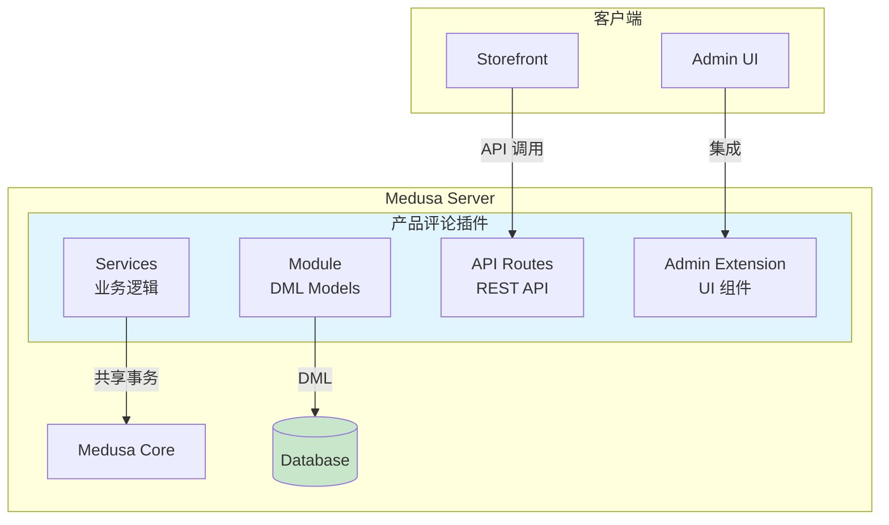
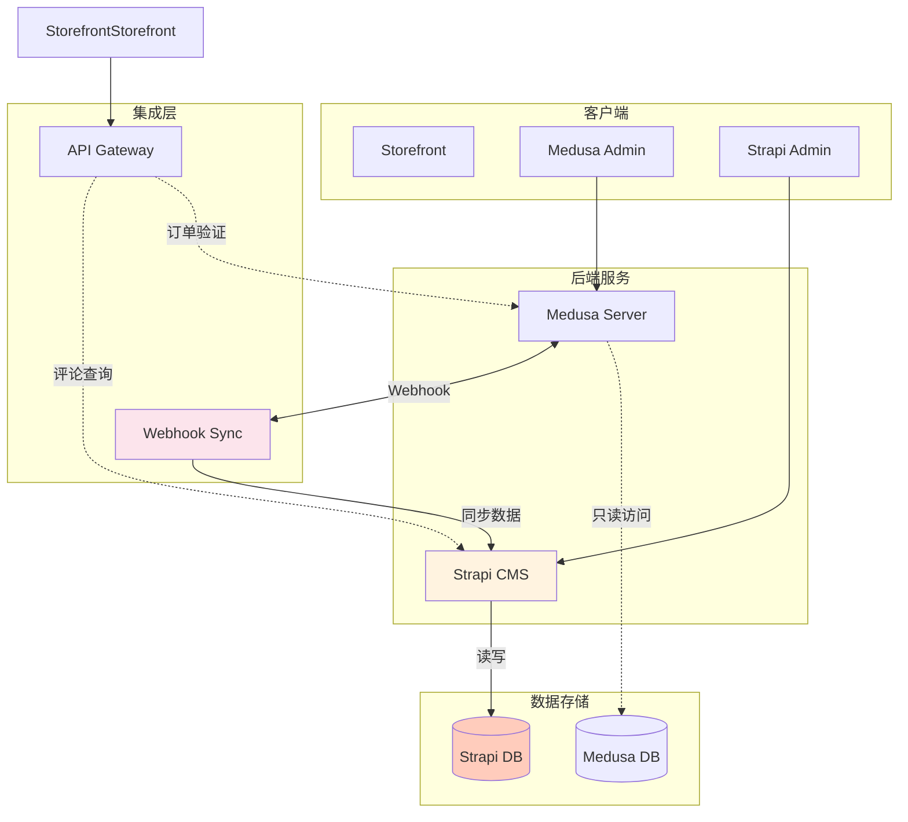

# 架构决策分析：产品评论功能
## Medusa 插件 vs Strapi 微服务方案对比

---

## 📋 目录

1. [方案概述](#方案概述)
2. [架构图](#架构图)
3. [详细对比](#详细对比)
4. [开发难度分析](#开发难度分析)
5. [性能影响分析](#性能影响分析)
6. [扩展性分析](#扩展性分析)
7. [成本分析](#成本分析)
8. [风险评估](#风险评估)
9. [推荐方案](#推荐方案)

---

## 🎯 方案概述

### 方案 A：Medusa 插件（原生集成）

**架构描述：**
- 基于 Medusa 2.13+ 模块化架构
- 直接使用 Medusa 的 DML、Services、API 路由
- 紧密集成到 Medusa Admin UI
- 共享 Medusa 的数据库和事务管理

**适用场景：**
- 评论功能与订单、产品深度关联
- 需要强事务一致性
- 团队熟悉 Medusa 架构
- 追求最低延迟

### 方案 B：Strapi 微服务（独立服务）

**架构描述：**
- 使用 Strapi 作为独立的 Headless CMS
- 通过 API Gateway 与 Medusa 交互
- 独立数据库和管理后台
- 异步同步产品、客户、订单数据

**适用场景：**
- 需要强大的内容管理能力
- 团队有 Strapi 经验
- 未来可能扩展其他 CMS 功能
- 可以容忍最终一致性

---

## 🏗️ 架构图

### 方案 A：Medusa 插件架构

### 方案 B：Strapi 微服务架构

---

## ⚖️ 详细对比

### 1. 数据一致性

| 维度 | Medusa 插件 | Strapi 微服务 |
|------|-------------|---------------|
| **事务一致性** | ✅ 强一致性 共享数据库和事务 | ❌ 最终一致性 跨服务数据同步 |
| **数据同步** | ✅ 无需同步 同一数据源 | ⚠️ 需要同步机制 Webhook/定时任务 |
| **数据完整性** | ✅ 外键约束 数据库级别保证 | ⚠️ 应用层保证 需要额外校验 |
| **回滚机制** | ✅ 自动回滚 事务失败一致性 | ⚠️ 手动处理 补偿事务 |

**分析：** 如果产品评论与订单、客户的关系需要严格保证（如：只有已购买产品的用户才能评论），Medusa 插件方案明显更优。

---

### 2. 开发体验

| 维度 | Medusa 插件 | Strapi 微服务 |
|------|-------------|---------------|
| **学习曲线** | 🔴 高 Medusa 2.13 新架构 | 🟡 中等 Strapi 相对成熟 |
| **文档质量** | 🟡 中等 2.13+ 文档在完善 | 🟢 优秀 Strapi 文档齐全 |
| **社区支持** | 🟡 中等 新架构社区较少 | 🟢 优秀 大型活跃社区 |
| **开发工具** | 🟡 基础 官方 CLI 有限 | 🟢 丰富 插件生态完善 |
| **调试难度** | 🔴 较高 需要理解 Medusa 核心 | 🟡 中等 独立服务易调试 |

**分析：** 团队技术栈和学习能力是关键因素。如果团队已经熟悉 Medusa，插件方案可行；否则 Strapi 可能更快上手。

---

### 3. 管理后台

| 维度 | Medusa 插件 | Strapi 微服务 |
|------|-------------|---------------|
| **UI 集成** | ✅ 无缝集成 统一的 Admin UI | ❌ 分离界面 需要登录两套系统 |
| **权限管理** | ✅ 统一权限 复用 Medusa RBAC | ⚠️ 双重权限 需要维护两套 |
| **用户体验** | ✅ 一致体验 统一的界面风格 | ❌ 分散体验 不同系统风格 |
| **开发工作量** | 🔴 较大 需学习 Admin SDK | 🟢 较小 Strapi 提供现成后台 |

---

### 4. API 设计

| 维度 | Medusa 插件 | Strapi 微服务 |
|------|-------------|---------------|
| **API 风格** | ✅ RESTful 遵循 Medusa 规范 | ⚠️ 可自定义 需要设计规范 |
| **数据格式** | ✅ 统一格式 与 Medusa 一致 | ⚠️ 可能不一致 需要适配层 |
| **版本管理** | ✅ 随 Medusa | 🟡 独立管理 |
| **API 文档** | 🟡 生成文档 需维护 | 🟢 自动生成 Strapi 内置 |

---

### 5. 依赖管理

| 维度 | Medusa 插件 | Strapi 微服务 |
|------|-------------|---------------|
| **版本耦合** | 🔴 高耦合 依赖 Medusa 版本 | ✅ 低耦合 独立升级 |
| **依赖冲突** | ⚠️ 可能冲突 共享依赖 | ✅ 独立依赖 隔离环境 |
| **升级风险** | 🔴 高风险 Medusa 升级可能破坏 | 🟢 低风险 独立升级 |

---

## 🔧 开发难度分析

### Medusa 插件开发任务清单

| 任务 | 复杂度 | 预计时间 | 风险 |
|------|--------|----------|------|
| 学习 Medusa 2.13 架构 | 🔴 高 | 8-16h | 团队是否愿意投入 |
| DML 模型定义 | 🟡 中 | 4-8h | 类型复杂度 |
| 模块迁移脚本 | 🟡 中 | 3-6h | 数据迁移风险 |
| Services 重构 | 🔴 高 | 12-24h | 事务逻辑复杂度 |
| Repositories 实现 | 🟡 中 | 4-8h | 查询复杂度 |
| API Routes 开发 | 🟡 中 | 6-12h | 认证/授权 |
| Admin UI 扩展 | 🔴 高 | 12-20h | UI 复杂度 |
| 集成测试 | 🟡 中 | 8-12h | 覆盖率要求 |
| 文档编写 | 🟢 低 | 4-6h | - |
| **总计** | - | **53-112h** | **平均 80h** |

### Strapi 微服务开发任务清单

| 任务 | 复杂度 | 预计时间 | 风险 |
|------|--------|----------|------|
| Strapi 项目初始化 | 🟢 低 | 1-2h | - |
| Content Types 定义 | 🟢 低 | 4-6h | - |
| 权限/角色配置 | 🟢 低 | 2-4h | - |
| Webhook 同步 Medusa | 🔴 高 | 12-20h | 数据一致性 |
| API Gateway 设计 | 🟡 中 | 8-12h | 路由/聚合 |
| 前端适配 | 🟡 中 | 8-12h | API 格式适配 |
| 双写/同步测试 | 🔴 高 | 10-16h | 边界条件 |
| 监控/告警 | 🟡 中 | 4-8h | 系统稳定性 |
| 文档编写 | 🟢 低 | 4-6h | - |
| **总计** | - | **53-86h** | **平均 70h** |

**结论：** 两者开发时间相近，但 Strapi 方案在初期可能更快见效，长期维护成本更高。

---

## 📊 性能影响分析

### 延迟分析

| 场景 | Medusa 插件 | Strapi 微服务 | 差异 |
|------|-------------|---------------|------|
| **创建评论** | ~100-150ms 单次事务 | ~200-300ms API Gateway + Strapi | +100-200ms |
| **查询评论列表** | ~50-80ms 直接查询 | ~100-150ms 跨服务查询 | +50-70ms |
| **评论统计** | ~30-50ms 聚合查询 | ~60-100ms 远程调用 | +30-50ms |
| **Admin 列表加载** | ~100-200ms 集成查询 | ~150-250ms 额外 HTTP | +50-100ms |

### 吞吐量对比

| 指标 | Medusa 插件 | Strapi 微服务 |
|------|-------------|---------------|
| **并发处理** | 受 Medusa 单进程限制 | 可独立扩展 |
| **缓存策略** | 共享 Medusa 缓存 | 独立缓存层 |
| **资源隔离** | ❌ 共享资源池 | ✅ 独立资源池 |

### 资源消耗

| 资源 | Medusa 插件 | Strapi 微服务 |
|------|-------------|---------------|
| **内存** | +50-100MB 共享堆内存 | +200-400MB 独立进程 |
| **CPU** | 共享 可能竞争 | 独立 弹性扩展 |
| **数据库** | 共享 Medusa DB | 独立 Strapi DB + 同步开销 |

---

## 🚀 扩展性分析

### 功能扩展场景

| 场景 | Medusa 插件 | Strapi 微服务 |
|------|-------------|---------------|
| **添加评论图片** | ✅ 直接集成 File Service | ✅ Strapi 原生支持 |
| **评论点赞/回复** | ✅ 添加 DML + API | ✅ 添加 Content Type |
| **多语言支持** | ⚠️ 需手动实现 | ✅ Strapi i18n 插件 |
| **评论审核工作流** | ⚠️ 需手动实现 | ✅ Strapi 审批插件 |
| **富文本编辑器** | ⚠️ 需集成 | ✅ 多种编辑器插件 |
| **全文搜索** | ⚠️ 需外部服务 | ✅ 多个搜索插件 |
| **内容版本管理** | ❌ 不支持 | ✅ Strapi 原生支持 |

### 系统扩展

| 维度 | Medusa 插件 | Strapi 微服务 |
|------|-------------|---------------|
| **水平扩展** | 🔴 有限 受 Medusa 架构限制 | ✅ 灵活 独立服务扩展 |
| **垂直扩展** | 🟡 受限 共享资源 | ✅ 独立 可独立配置 |
| **技术栈演进** | 🔴 耦合 依赖 Medusa 演进 | ✅ 独立 可自由选择技术 |

---

## 💰 成本分析

### 开发成本

| 成本项 | Medusa 插件 | Strapi 微服务 |
|--------|-------------|---------------|
| **初始开发** | ~$4,000-8,000 | ~$4,000-7,000 |
| **学习投入** | 高（Medusa 新架构） | 中（Strapi 更成熟） |
| **工具链搭建** | 低（复用 Medusa） | 中（需要搭建 Gateway） |

### 运维成本

| 成本项 | Medusa 插件 | Strapi 微服务 |
|--------|-------------|---------------|
| **服务器资源** | 低（共享资源） | 高（独立实例 + DB） |
| **监控复杂度** | 低（单一系统） | 高（多服务监控） |
| **故障排查** | 中（集成系统） | 高（分布式系统） |
| **备份策略** | 简单（单一 DB） | 复杂（多 DB 同步） |
| **月度运维** | ~$100-300 | ~$300-600 |

### 维护成本

| 成本项 | Medusa 插件 | Strapi 微服务 |
|--------|-------------|---------------|
| **版本升级** | 高（耦合 Medusa） | 中（相对独立） |
| **Bug 修复** | 中（定位可能困难） | 中（独立易定位） |
| **安全补丁** | 复杂（需等待 Medusa） | 灵活（独立处理） |

---

## ⚠️ 风险评估

### 技术风险

| 风险项 | Medusa 插件 | Strapi 微服务 | 评估 |
|--------|-------------|---------------|------|
| **架构变更** | 🔴 高 Medusa 2.x 仍在演进 | 🟢 低 Strapi 较稳定 | Strapi 更稳定 |
| **API 废弃** | 🔴 高 2.x 变化频繁 | 🟢 低 向后兼容性好 | Strapi 更稳定 |
| **社区支持** | 🟡 中 新架构社区小 | 🟢 优 大型社区 | Strapi 更优 |
| **团队经验** | ⚠️ 评估团队 | ⚠️ 评估团队 | 视团队而定 |

### 业务风险

| 风险项 | Medusa 插件 | Strapi 微服务 | 评估 |
|--------|-------------|---------------|------|
| **数据丢失** | 🟢 低 强事务保证 | 🔴 高 同步失败风险 | Medusa 更安全 |
| **数据不一致** | 🟢 低 一致性保证 | 🟡 中 最终一致性 | Medusa 更安全 |
| **服务中断** | 🟡 中 单点故障 | 🟢 低 独立故障域 | Strapi 更灵活 |
| **性能退化** | 🟡 中 共享资源竞争 | 🟢 低 独立扩展 | Strapi 更灵活 |

---

## 🎯 推荐方案

### 决策矩阵

| 评估维度 | 权重 | Medusa 插件 | Strapi 微服务 |
|----------|------|-------------|---------------|
| **数据一致性** | 25% | 9/10 | 5/10 |
| **开发速度** | 15% | 5/10 | 7/10 |
| **性能表现** | 15% | 8/10 | 6/10 |
| **扩展性** | 10% | 6/10 | 9/10 |
| **维护成本** | 15% | 6/10 | 7/10 |
| **运维复杂度** | 10% | 7/10 | 5/10 |
| **学习曲线** | 10% | 4/10 | 7/10 |
| **加权总分** | - | **6.95** | **6.35** |

### 推荐结论

#### 🏆 首选方案：Medusa 插件

**推荐理由：**

1. **数据一致性是电商核心** - 产品评论与订单、产品关系紧密，强一致性至关重要
2. **架构契合度高** - 评论功能本质是电商业务的扩展，而非独立 CMS
3. **长期价值** - 随着对 Medusa 2.13 的深入理解，团队可开发更多插件
4. **用户体验优** - 统一的 Admin UI，无需在多系统间切换
5. **运维简单** - 单一系统监控、备份、部署

**适用条件：**
- ✅ 评论与订单/产品强关联
- ✅ 数据一致性要求高
- ✅ 团队愿意学习 Medusa 新架构
- ✅ 希望长期深耕 Medusa 生态

#### 🥈 备选方案：Strapi 微服务

**适用场景：**

1. **需要强大的 CMS 能力** - 多语言、版本管理、富文本、工作流
2. **团队已有 Strapi 经验** - 降低学习成本
3. **未来扩展其他内容功能** - 博客、FAQ、帮助文档等
4. **可以接受最终一致性** - 评论延迟 1-2 秒同步可接受