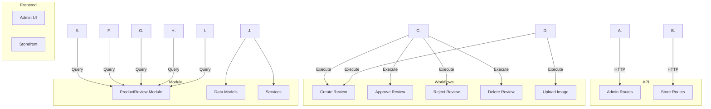

# Medusa 2.13+ Smart Product Reviews Plugin 架构计划

## 项目信息

- **插件名称**: `medusa-plugin-smart-product-reviews`
- **作者**: leonardozhe
- **GitHub**: https://github.com/leonardozhe/medusa-plugin-smart-product-reviews
- **目标版本**: Medusa 2.13+
- **版权**: 完全新建版权版本

## 功能概述

一个高性能、美观、安全的产品评论插件，支持：
- ✅ 顾客提交产品评论（1-5 星评分）
- ✅ 评论审核流程（待审核、已批准、已拒绝）
- ✅ 多张图片上传
- ✅ 管理员审核管理
- ✅ 评论统计数据
- ✅ 安全的权限控制
- ✅ 高性能查询优化

## API Routes 设计

### Admin API Routes（管理员）

| 方法 | 路径 | 描述 | 认证 |
|------|------|------|------|
| GET | `/admin/product/product_reviews` | 获取所有评论列表 | 管理员 |
| POST | `/admin/product/product_reviews/:id/approve` | 批准评论 | 管理员 |
| POST | `/admin/product/product_reviews/:id/reject` | 拒绝评论 | 管理员 |
| DELETE | `/admin/product/product_reviews/:id` | 删除评论 | 管理员 |
| GET | `/admin/product_review_requests` | 获取评论请求列表 | 管理员 |

### Store API Routes（店铺）

| 方法 | 路径 | 描述 | 认证 |
|------|------|------|------|
| GET | `/store/product/product_reviews` | 获取产品评论（仅已批准） | 公开 |
| POST | `/store/product/product_reviews` | 创建评论（默认待审核） | 顾客登录 |
| POST | `/store/product_reviews/image_upload` | 上传评论图片 | 顾客登录 |

## Medusa 2.13+ 架构设计

### 核心架构模式



### 目录结构

```
medusa-plugin-smart-product-reviews/
├── .gitignore
├── package.json
├── tsconfig.json
├── README.md
├── LICENSE
├── CHANGELOG.md
│
├── src/
│   ├── index.ts                          # 插件入口
│   │
│   ├── module.ts                          # 模块定义
│   │
│   ├── modules/                           # 自定义模块
│   │   └── product-review/
│   │       ├── models/
│   │       │   ├── product-review.ts      # 评论实体
│   │       │   ├── product-review-image.ts # 图片实体
│   │       │   └── product-review-request.ts # 请求实体
│   │       │
│   │       ├── services/
│   │       │   ├── product-review-service.ts
│   │       │   ├── product-review-image-service.ts
│   │       │   └── product-review-request-service.ts
│   │       │
│   │       └── index.ts                   # 模块导出
│   │
│   ├── workflows/                         # 工作流
│   │   ├── steps/                         # 工作流步骤
│   │   │   ├── create-product-review.ts
│   │   │   ├── approve-product-review.ts
│   │   │   ├── reject-product-review.ts
│   │   │   ├── delete-product-review.ts
│   │   │   └── upload-review-image.ts
│   │   │
│   │   ├── create-product-review.ts
│   │   ├── approve-product-review.ts
│   │   ├── reject-product-review.ts
│   │   ├── delete-product-review.ts
│   │   └── index.ts
│   │
│   ├── links/                             # 模块链接
│   │   └── product-review-links.ts        # 关联 Product/Customer
│   │
│   ├── api/                               # API 路由
│   │   ├── admin/
│   │   │   └── product-reviews.ts
│   │   └── store/
│   │       ├── product-reviews.ts
│   │       └── product-review-image-upload.ts
│   │
│   ├── admin/                             # Admin UI 扩展
│   │   ├── widgets/
│   │   │   └── product-review-list.tsx
│   │   ├── routes/
│   │   │   └── reviews-management.tsx
│   │   └── menu.ts
│   │
│   └── types/                             # 类型定义
│       └── index.ts
```

## 数据模型设计

### ProductReview 实体

```typescript
import { model } from "@medusajs/framework/utils"
import ProductReviewImage from "./product-review-image"

const ProductReview = model.define("product_review", {
  id: model.id().primaryKey(),
  product_id: model.text(),
  customer_id: model.text().nullable(),
  
  rating: model.number(), // 1-5
  title: model.text(),
  content: model.text(),
  
  status: model.enum(["pending", "approved", "rejected"]),
  rejection_reason: model.text().nullable(),
  
  images: model.hasMany(() => ProductReviewImage, {
    mappedBy: "review_id",
  }),
  
  // 统计字段（缓存）
  helpful_count: model.number().default(0),
  reported_count: model.number().default(0),
  
  created_at: model.dateTime(),
  updated_at: model.dateTime(),
  deleted_at: model.dateTime().nullable(),
})

export default ProductReview
```

### ProductReviewImage 实体

```typescript
import { model } from "@medusajs/framework/utils"
import ProductReview from "./product-review"

const ProductReviewImage = model.define("product_review_image", {
  id: model.id().primaryKey(),
  review_id: model.text(),
  
  url: model.text(),
  alt_text: model.text().nullable(),
  
  created_at: model.dateTime(),
  
  review: model.belongsTo(() => ProductReview, {
    foreignKey: "review_id",
  }),
})

export default ProductReviewImage
```

### ProductReviewRequest 实体

```typescript
import { model } from "@medusajs/framework/utils"

const ProductReviewRequest = model.define("product_review_request", {
  id: model.id().primaryKey(),
  product_id: model.text(),
  customer_id: model.text(),
  
  requested_at: model.dateTime(),
  
  status: model.enum(["pending", "fulfilled"]),
})

export default ProductReviewRequest
```

## Workflow 设计

### 创建评论工作流

```typescript
import {
  createWorkflow,
  WorkflowResponse,
  transform,
} from "@medusajs/framework/workflows-sdk"

import { createProductReviewStep } from "./steps/create-product-review"
import { uploadReviewImagesStep } from "./steps/upload-review-image"

type CreateProductReviewInput = {
  product_id: string
  customer_id: string
  title: string
  content: string
  rating: number
  image_urls?: string[]
}

export const createProductReviewWorkflow = createWorkflow(
  "create-product-review",
  function (input: CreateProductReviewInput) {
    const review = create.createProductReviewStep({
      product_id: input.product_id,
      customer_id: input.customer_id,
      title: input.title,
      content: input.content,
      rating: input.rating,
      status: "pending",
    })

    const images = transform(
      { review, image_urls: input.image_urls },
      ({ review, image_urls }) => {
        if (!image_urls || image_urls.length === 0) return []
        return image_urls.map(url => ({
          review_id: review.id,
          url,
        }))
      }
    )

    const uploadedImages = uploadReviewImagesStep(images)

    return new WorkflowResponse({
      review,
      images: uploadedImages,
    })
  }
)
```

## API 路由实现

### Store Routes 示例

```typescript
import { MedusaRequest, MedusaResponse } from "@medusajs/framework"
import { createProductReviewWorkflow } from "../../workflows/create-product-review"

export const POST = async (
  req: MedusaRequest<CreateProductReviewInput>,
  res: MedusaResponse
) => {
  const workflow = createProductReviewWorkflow(req.scope)
  
  const { result } = await workflow.run({
    input: req.validatedBody,
  })

  res.status(201).json({ product_review: result.review })
}

export const GET = async (
  req: MedusaRequest,
  res: MedusaResponse
) => {
  const query = req.scope.resolve("query")
  
  const reviews = await query.graph({
    entity: "product_review",
    fields: ["id", "rating", "title", "content", "created_at"],
    links: {
      images: {
        fields: ["id", "url"],
      },
    },
    filters: {
      status: "approved",
      product_id: req.query.product_id,
    },
  })

  res.json({ product_reviews: reviews })
}
```

## Admin UI 设计

### Widget: 产品评论概览

**位置**: 产品详情页

```tsx
import { defineWidgetConfig } from "@medusajs/admin-sdk"
import { Container, Heading, Text } from "@medusajs/ui"

export default defineWidgetConfig({
  zone: "product.details.before",
  data: async (props: WidgetProps) => {
    const { data: reviews } = await props.fetch(
      `http://localhost:9000/admin/product/product_reviews`,
      {
        query: {
          product_id: props.data.product.id,
        },
      }
    )
    return reviews
  },
  ui: ({ data, props }) => {
    return (
      <Container>
        <Heading level="h3">产品评论</Heading>
        <Text>总评论数: {data.product_reviews.length}</Text>
        {/* 平均评分、待审核数量等 */}
      </Container>
    )
  },
})
```

## 安全考虑

1. **权限控制**
   - 所有 Admin 路由需要管理员权限
   - Store 路由使用 Customer 认证
   - 用户只能删除自己的评论

2. **输入验证**
   - 使用 Zod schema 验证所有输入
   - 限制评论标题和内容长度
   - 验证评分范围（1-5）

3. **XSS 防护**
   - 对用户输入进行转义
   - 使用 Content Security Policy

4. **文件上传安全**
   - 验证图片类型和大小
   - 使用安全的存储路径
   - 限制上传频率

## 性能优化

1. **数据库索引**
   - 在 `product_id`、`customer_id`、`status` 上创建索引
   - 复合索引 `(product_id, status)` 用于常用查询

2. **查询优化**
   - 使用 `query.graph()` 进行跨模块查询
   - 使用分页避免一次性加载大量数据
   - 缓存统计数据

3. **图片优化**
   - 支持图片缩略图
   - 使用 CDN 加速
   - 懒加载图片

4. **批量操作**
   - 批量批准/拒绝评论
   - 批量删除评论

## 实施步骤

### 第一阶段：核心功能
1. 清空现有项目
2. 创建新的 package.json（更新作者、GitHub 等）
3. 创建数据模型
4. 创建模块服务
5. 创建数据库迁移

### 第二阶段：API 和工作流
6. 创建 Workflow Steps
7. 创建 Workflow Compositions
8. 创建 API Routes（Store 和 Admin）
9. 创建模块链接

### 第三阶段：Admin UI
10. 创建 Admin Widgets
11. 创建 Admin Routes
12. 创建 Admin Menu

### 第四阶段：完善
13. 更新 README.md
14. 配置 TypeScript
15. 添加测试
16. 更新 Git 配置（非 fork 模式）

## 新的 package.json 配置

```json
{
  "name": "medusa-plugin-smart-product-reviews",
  "version": "1.0.0",
  "description": "A smart product reviews plugin for Medusa with moderation, image support, and admin management",
  "main": "dist/index.js",
  "types": "dist/index.d.ts",
  "author": "leonardozhe",
  "repository": {
    "type": "git",
    "url": "https://github.com/leonardozhe/medusa-plugin-smart-product-reviews.git"
  },
  "homepage": "https://github.com/leonardozhe/medusa-plugin-smart-product-reviews",
  "license": "MIT",
  "keywords": [
    "medusa",
    "medusa-plugin",
    "product-reviews",
    "reviews",
    "moderation"
  ],
  "scripts": {
    "build": "medusa-plugin build",
    "dev": "medusa-plugin develop",
    "test": "jest"
  },
  "peerDependencies": {
    "@medusajs/framework": "^2.13.0"
  },
  "dependencies": {
    "@medusajs/admin-sdk": "^2.13.0",
    "@medusajs/ui": "^4.1.1",
    "zod": "^3.23.0"
  },
  "devDependencies": {
    "@medusajs/medusa": "^2.13.0",
    "@types/node": "^20.16.0",
    "typescript": "^5.6.0"
  }
}
```

## 新的 README 结构

```markdown
# Medusa Smart Product Reviews Plugin

一个高性能、美观、安全的产品评论插件，专为 Medusa v2.13+ 设计。

## 功能特性

- [x] 1-5 星评分系统
- [x] 评论审核流程
- [x] 多图片上传支持
- [x] 管理员审核管理
- [x] 评论统计数据
- [x] 安全的权限控制
- [x] 高性能查询优化

## 安装

## 配置

## 使用

## API 文档

## 贡献

## 许可证
```
