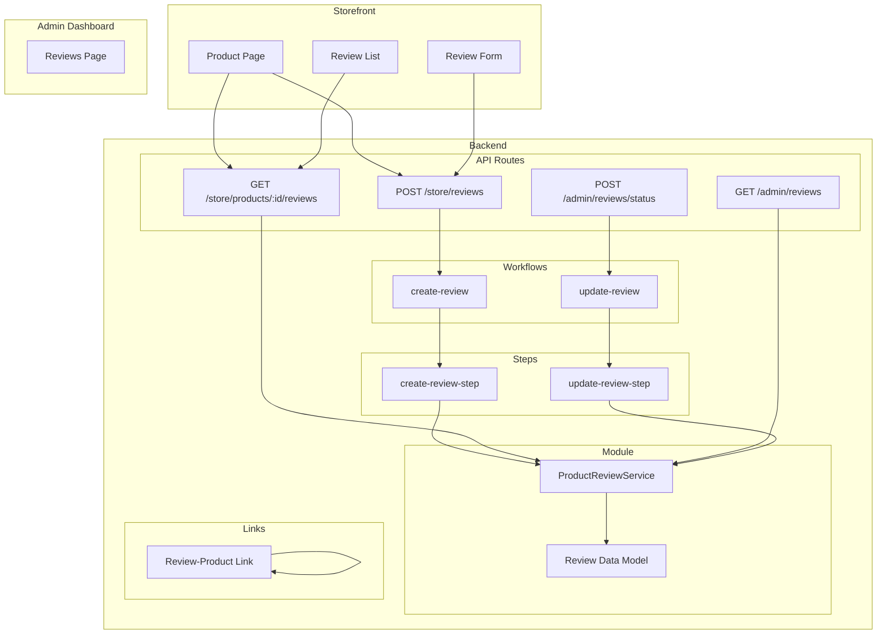

# Medusa 2.13 评论功能开发计划

> 基于 Medusa 官方文档的评论功能开发指南
> 版本: Medusa 2.13

---

## 功能概述

本次开发将实现完整的商品评论功能，包括：

### 核心功能
- ✅ 商品评论创建（需客户登录）
- ✅ 评论审核功能（管理员批准/拒绝）
- ✅ 评论删除功能
- ✅ 评论列表展示（管理员端）
- ✅ 商品页面展示已批准的评论
- ✅ 评论平均评分计算

### 技术架构



---

## 文件结构

```
medusa-backend/
├── src/
│   ├── modules/
│   │   └── product-review/
│   │       ├── models/
│   │       │   └── review.ts           # Review 数据模型
│   │       ├── service.ts               # 模块服务
│   │       ├── index.ts                  # 模块定义
│   │       └── migrations/               # 自动生成的迁移文件
│   │
│   ├── links/
│   │   └── review-product.ts            # Review-Product 链接定义
│   │
│   ├── workflows/
│   │   ├── create-review.ts              # 创建评论工作流
│   │   ├── update-review.ts              # 更新评论状态工作流
│   │   └── steps/
│   │       ├── create-review.ts          # 创建评论步骤
│   │       └── update-review.ts          # 更新评论步骤
│   │
│   ├── api/
│   │   ├── store/
│   │   │   ├── reviews/
│   │   │   │   └── route.ts             # POST /store/reviews
│   │   │   └── products/
│   │   │       └── [id]/
│   │   │           └── reviews/
│   │   │               └── route.ts     # GET /store/products/:id/reviews
│   │   ├── admin/
│   │   │   ├── reviews/
│   │   │   │   ├── route.ts             # GET /admin/reviews
│   │   │   │   └── status/
│   │   │   │       └── route.ts         # POST /admin/reviews/status
│   │   │   └── reviews/
│   │   │       ├── route.ts             # GET /admin/reviews
│   │   │       └── status/
│   │   │           └── route.ts         # POST /admin/reviews/status
│   │   └── middlewares.ts               # 验证和认证中间件
│   │
│   └── admin/
│       ├── lib/
│       │   └── sdk.ts                    # Admin JS SDK 配置
│       └── routes/
│           └── reviews/
│               └── page.tsx             # Admin 评论管理页面
│
└── medusa-config.ts                      # Medusa 配置（添加模块）
```

---

## 开发任务列表

### 阶段 1: 模块开发（数据层）

- [ ] **Step 1**: 创建 Product Review Module
  - [ ] 创建目录 `src/modules/product-review`
  - [ ] 创建数据模型 `src/modules/product-review/models/review.ts`
  - [ ] 创建模块服务 `src/modules/product-review/service.ts`
  - [ ] 导出模块定义 `src/modules/product-review/index.ts`
  - [ ] 在 `medusa-config.ts` 中注册模块

### 阶段 2: 数据库迁移

- [ ] **Step 2**: 生成并运行数据库迁移
  - [ ] 运行 `npx medusa db:generate productReview`
  - [ ] 运行 `npx medusa db:migrate`

### 阶段 3: 模块链接

- [ ] **Step 3**: 定义 Review-Product 链接
  - [ ] 创建 `src/links/review-product.ts`

### 阶段 4: 工作流开发

- [ ] **Step 4**: 创建评论工作流
  - [ ] 创建步骤 `src/workflows/steps/create-review.ts`
  - [ ] 创建工作流 `src/workflows/create-review.ts`

- [ ] **Step 5**: 创建更新评论状态工作流
  - [ ] 创建步骤 `src/workflows/steps/update-review.ts`
  - [ ] 创建工作流 `src/workflows/update-review.ts`

### 阶段 5: API 路由开发

- [ ] **Step 6**: Store API 路由
  - [ ] 创建 `src/api/store/reviews/route.ts` (POST - 创建评论)
  - [ ] 创建 `src/api/store/products/[id]/reviews/route.ts` (GET - 获取商品评论)

- [ ] **Step 7**: Admin API 路由
  - [ ] 创建 `src/api/admin/reviews/route.ts` (GET - 获取评论列表)
  - [ ] 创建 `src/api/admin/reviews/status/route.ts` (POST - 批准/拒绝评论)

- [ ] **Step 8**: 中间件配置
  - [ ] 创建/更新 `src/api/middlewares.ts`
    - 客户认证中间件（POST /store/reviews）
    - 请求体验证中间件（所有路由）

### 阶段 6: Admin UI 开发

- [ ] **Step 9**: Admin 评论管理页面
  - [ ] 配置 JS SDK `src/admin/lib/sdk.ts`
  - [ ] 创建评论列表页面 `src/admin/routes/reviews/page.tsx`
  - [ ] 添加审核操作（批准/拒绝）
  - [ ] 添加删除功能

### 阶段 7: 测试与验证

- [ ] **Step 10**: 测试后端功能
  - [ ] 启动开发服务器 `npm run dev`
  - [ ] 测试创建评论 API
  - [ ] 测试获取评论列表 API
  - [ ] 测试评论审核 API

---

## API 路由说明

### Store API Routes

#### POST /store/reviews
**描述**: 创建商品评论（需要客户认证）

**请求体**:
```json
{
  "title": "string (optional)",
  "content": "string (required)",
  "rating": "number (1-5, required)",
  "product_id": "string (required)",
  "first_name": "string (required)",
  "last_name": "string (required)"
}
```

**响应**:
```json
{
  "review": {
    "id": "string",
    "title": "string",
    "content": "string",
    "rating": "number",
    "product_id": "string",
    "customer_id": "string",
    "status": "pending",
    ...
  }
}
```

#### GET /store/products/:id/reviews
**描述**: 获取指定商品的已批准评论列表

**查询参数**:
- `limit`: 每页数量（默认: 10）
- `offset`: 偏移量（默认: 0）
- `order`: 排序（默认: -created_at）

**响应**:
```json
{
  "reviews": [...],
  "count": "number",
  "limit": "number",
  "offset": "number",
  "average_rating": "number"
}
```

### Admin API Routes

#### GET /admin/reviews
**描述**: 获取所有评论列表（需要管理员认证）

**查询参数**:
- `limit`: 每页数量（默认: 20）
- `offset`: 偏移量（默认: 0）
- `order`: 排序（默认: -created_at）

**响应**:
```json
{
  "reviews": [...],
  "count": "number",
  "limit": "number",
  "offset": "number"
}
```

#### POST /admin/reviews/status
**描述**: 批准或拒绝评论（批量操作）

**请求体**:
```json
{
  "ids": ["string"],
  "status": "approved | rejected | pending"
}
```

**响应**:
```json
{
  "reviews": [...]
}
```

---

## 数据模型

### Review Model

| 字段 | 类型 | 描述 |
|------|------|------|
| id | string | 唯一标识符（主键） |
| title | string? | 评论标题（可选） |
| content | string | 评论内容（必填） |
| rating | number | 评分（1-5，带约束） |
| first_name | string | 评论者名 |
| last_name | string | 评论者姓 |
| status | enum | 状态：pending/approved/rejected |
| product_id | string | 关联商品 ID（带索引） |
| customer_id | string? | 客户 ID（可选） |
| created_at | datetime | 创建时间 |
| updated_at | datetime | 更新时间 |

---

## 审核和删除功能说明

### 审核功能
评论审核通过以下 API 实现：

1. **批准评论**: 调用 `POST /admin/reviews/status`，将状态设为 `approved`
2. **拒绝评论**: 调用 `POST /admin/reviews/status`，将状态设为 `rejected`
3. **重置状态**: 调用 `POST /admin/reviews/status`，将状态设为 `pending`

只有状态为 `approved` 的评论会在 Storefront 商品页面显示。

### 删除功能
删除功能由 `MedusaService` 自动生成的 `deleteReviews` 方法提供：

- 在工作流的补偿函数中使用（自动回滚）
- 可通过模块服务直接调用（如需要）
- 也可以添加专门的删除 API 路由

---

## 测试步骤

### 1. 创建测试客户

```bash
# 获取注册令牌
curl -X POST 'http://localhost:9000/auth/customer/emailpass/register' \
  -H 'Content-Type: application/json' \
  --data-raw '{
    "email": "test@example.com",
    "password": "password123"
  }'

# 注册客户
curl -X POST 'http://localhost:9000/store/customers' \
  -H 'Authorization: Bearer {token}' \
  -H 'Content-Type: application/json' \
  -H 'x-publishable-api-key: {api_key}' \
  --data-raw '{
    "email": "test@example.com"
  }'

# 获取认证令牌
curl -X POST 'http://localhost:9000/auth/customer/emailpass' \
  -H 'Content-Type: application/json' \
  --data-raw '{
    "email": "test@example.com",
    "password": "password123"
  }'
```

### 2. 创建评论

```bash
curl --location 'http://localhost:9000/store/reviews' \
  --header 'x-publishable-api-key: {api_key}' \
  --header 'Content-Type: application/json' \
  --header 'Authorization: Bearer {token}' \
  --data '{
    "product_id": "{product_id}",
    "title": "Really good",
    "content": "The material is nice",
    "rating": 5,
    "first_name": "John",
    "last_name": "Smith"
  }'
```

### 3. 管理员审核评论

```bash
# 批准评论
curl -X POST 'http://localhost:9000/admin/reviews/status' \
  -H 'Authorization: Bearer {admin_token}' \
  -H 'Content-Type: application/json' \
  --data '{
    "ids": ["{review_id}"],
    "status": "approved"
  }'
```

---

## 注意事项

### Medusa 架构原则

1. **模块隔离**: 模块之间通过 Links 进行关联，不能直接创建跨模块关系
2. **工作流优先**: 所有变更操作必须通过 Workflows 执行
3. **HTTP 方法限制**: 只使用 GET、POST、DELETE（不使用 PUT/PATCH）
4. **类型安全**: 使用 Zod schema 进行请求体验证

### 关键规则

- ✅ 使用 `query.graph()` 进行跨模块数据查询
- ✅ 工作流步骤必须返回 `StepResponse`
- ✅ 工作流必须返回 `WorkflowResponse`
- ✅ 使用中间件进行认证和验证
- ❌ 不在 API 路由中直接调用模块服务
- ❌ 不使用 PUT/PATCH 方法
- ❌ 不在工作流函数中使用 async/await

---

## 参考资料

- [Medusa Modules 文档](https://docs.medusajs.com/learn/modules)
- [Medusa Workflows 文档](https://docs.medusajs.com/learn/fundamentals/workflows)
- [Medusa API Routes 文档](https://docs.medusajs.com/learn/fundamentals/api-routes)
- [Data Model Language (DML)](https://docs.medusajs.com/learn/data-models)
